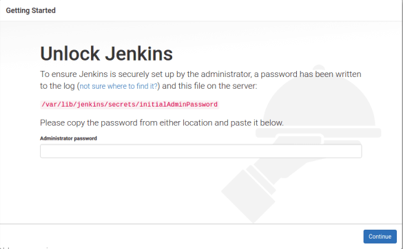
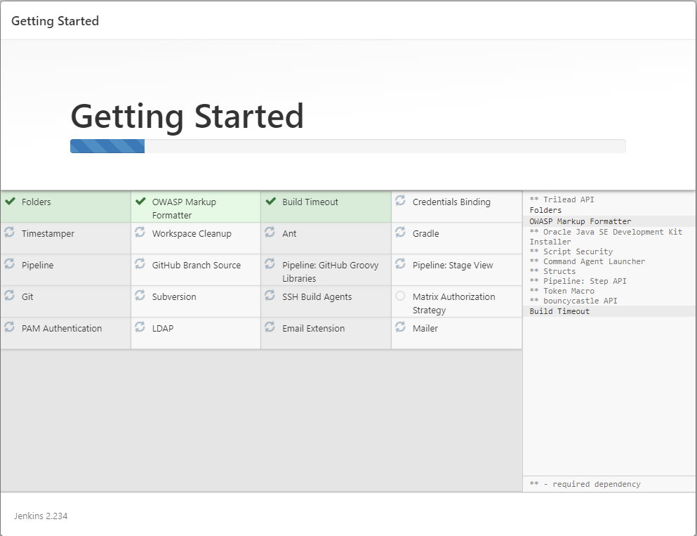
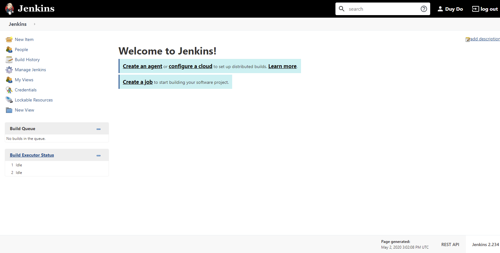

## What is Jenkins?

Jenkins is a self-contained, open-source automation server which can be used to automate all sorts of tasks related to building, testing, and delivering or deploying software.

Next, we are going to learn how to install Jenkins.

## Install and Configure Jenkins

### Prerequisite

- Connect to EC2. You can use the tool to access the EC2 like [Putty](https://www.putty.org/), [Poderosa](https://sourceforge.net/projects/poderosa/)
- Download and Install Jenkins
- Configure Jenkins


Before doing the steps make sure you have java1.8 rather then default java1.7 ship with Amazon AMI. If you could see the 1.7 version you can uninstall and install the 1.8 using following commands.
```
# yum install -y java-1.8.0-openjdk-devel.x86_64
```
and check the version using following commands.
```
# alternatives --config java
# java -version
```
To ensure that your software packages are up to date on your instance, use the following command to perform a quick software update:
```
# sudo yum update –y
```

Add the Jenkins repo using the following command:
```
# wget -O /etc/yum.repos.d/jenkins.repo http://pkg.jenkins-ci.org/redhat/jenkins.repo
```

Import a key file from Jenkins-CI to enable installation from the package:
```
# rpm — import http://pkg.jenkins-ci.org/redhat/jenkins-ci.org.key
```

Install Jenkins:
```
# yum install jenkins -y
```
 
Start Jenkins as a service.
```
systemctl start jenkins
```

Now, Visit the following address, ` http://server-ip-address:8081/ ` You can see the below screen as you visited above URL.



Then you could visit the directory path shown in above image and get the initial password to proceed with the installation.
```
# cat /var/lib/jenkins/secrets/initialAdminPassword
```
and paste it in the above image.




Here your installation steps completed and you can start configuring and managing the Jenkins CI server as per your requirement. Automate the task for your workflow. You can see the “Welcome to Jenkins!” message on the home page as shown below.




Hope you have enjoyed this article. To install Jenkins on another platform, you can refer below Jenkins documentation

## Reference

- https://jenkins.io/doc/book/installing/